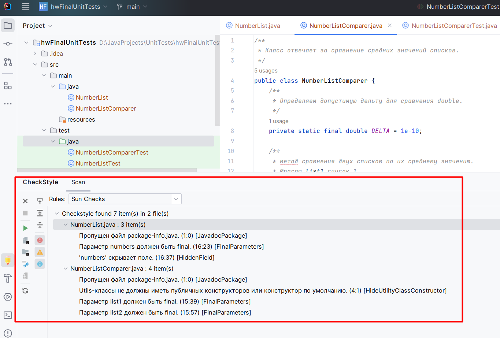
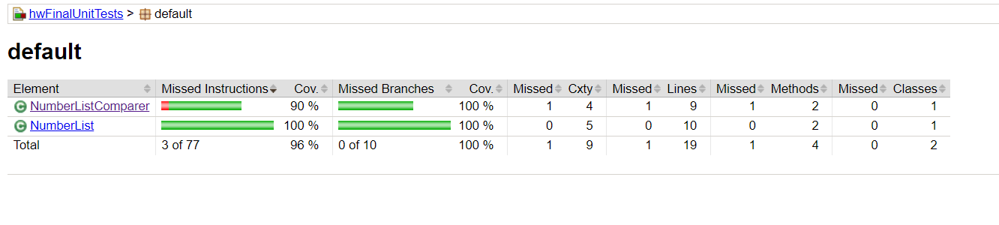

## Unit-тесты (семинары)
### Урок 6. Юнит тестирование в других языках
Задание 1. Создайте программу на Python или Java, которая принимает два списка чисел и выполняет следующие действия:

a. Рассчитывает среднее значение каждого списка.

b. Сравнивает эти средние значения и выводит соответствующее сообщение:
- ""Первый список имеет большее среднее значение"", если среднее значение первого списка больше.
- ""Второй список имеет большее среднее значение"", если среднее значение второго списка больше.
- ""Средние значения равны"", если средние значения списков равны.

Важно:

Приложение должно быть написано в соответствии с принципами объектно-ориентированного программирования.

Используйте Pytest (для Python) или JUnit (для Java) для написания тестов, которые проверяют правильность работы программы. Тесты должны учитывать различные сценарии использования вашего приложения.

Используйте pylint (для Python) или Checkstyle (для Java) для проверки качества кода.

Сгенерируйте отчет о покрытии кода тестами. Ваша цель - достичь минимум 90% покрытия.

***

- [Код программы](src/main/java)
- [Код тестов](src/test/java)
- Отчет Checkstyle
  
- [Отчет о покрытии тестами](target/site/jacoco/index.html)

Не работает встроенное средство для формирования отчета по метрикам покрытия тестов, поэтому пробовала подключить Jacoco
  

- Объяснение того, какие сценарии покрыты тестами и почему вы выбрали именно эти сценарии.
  
В созданных тестах покрыты различные сценарии использования для классов NumberList и NumberListComparer. Эти тесты охватывают различные варианты входных данных и ожидаемых результатов, чтобы убедиться, что реализация корректна и работает ожидаемым образом в разных условиях. Вот почему выбраны именно эти сценарии:

##### Тесты для класса NumberList:
1. Тестирование getAverage с одним элементом:

Покрывает сценарий, когда в списке только один элемент. Позволяет убедиться, что метод правильно вычисляет среднее значение для случая с одним элементом.
2. Тестирование getAverage с множественными элементами:

Проверяет случай, когда в списке много элементов. Удостоверяет, что метод корректно обрабатывает ситуацию с несколькими элементами.
3. Тестирование getAverage с отрицательными числами:

Тестирует случай, когда в списке есть отрицательные числа. Гарантирует, что метод правильно обрабатывает отрицательные значения.
4. Тестирование getAverage с пустым списком:

Проверяет, что метод выбрасывает исключение, если список пуст. Обеспечивает корректное поведение в случае пустого входного списка.
5. Тестирование getAverage с null списком:

Покрывает сценарий, когда метод вызывается с null списком. Убеждает, что метод выбрасывает исключение при работе с null входными данными.

##### Тесты для класса NumberListComparer:
1. Тестирование сравнения средних значений, когда они равны:

Гарантирует, что метод корректно обрабатывает случай, когда средние значения двух списков равны. Проверяет правильность вывода сообщения "Средние значения равны".
2. Тестирование сравнения средних значений, когда первый список больше:

Удостоверяет, что метод правильно определяет, что среднее значение первого списка больше среднего значения второго списка. Проверяет правильность вывода сообщения "Первый список имеет большее среднее значение".
3. Тестирование сравнения средних значений, когда второй список больше:

Проверяет, что метод корректно определяет, что среднее значение второго списка больше среднего значения первого списка. Проверяет правильность вывода сообщения "Второй список имеет большее среднее значение".

Выбор этих сценариев обеспечивает обширное покрытие функциональности классов, включая крайние случаи и 
различные варианты входных данных. Такие тесты помогают обнаружить и исправить ошибки и убеждаются в том, 
что приложение работает корректно в различных ситуациях.
